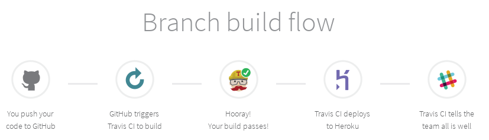

# Git Workflow y Estandares

## Estandares

- Poner verbos en imperativo en los mensajes de commit
 ~~~
 Arregla formulario de login
 ~~~
> Arregla,modifica,cambia,agregar,elimina,mejora son buenos verbos
- poner nombre cortos y si se hace un cambio importante explicar el por que, no el como
~~~
Cambiar color lanpage

Se cambia el color ya que provoca cansancio segun HCI
~~~
- No poner nombres de commit como 
~~~
Agregar helper.js
~~~
> esto aparece en la informacion del commit no es necesario poner informacion redundante

~~~
cambia for por while
~~~
> usando el comando git diff puedes revisar los cambios asi que no es necesario explicar que se hizo explicitamente , quizas seria mejor algo como
~~~
Modifica Interador

Dada la cantidad de operaciones es mejor usar un while para ahorrar computo 
~~~

## Workflow

Para mejorar el trabajo,orden y profesionalismo,usaremos feature branch

**ramas**
- **master** : rama usada para integrar cambios
- **stable** : usada para deploy 

> **Nota Importante** no pushiar a la rama master, sin haber consultado con el resto del equipo

> **Nota importante** probar el codigo antes de integrarlo a la rama dev (test manual sirve, pero seria util hacerlo con Unit Testing para utilizar la integracion continua de manera adecuada)

- No hay problema con subir sus propias ramas a github

- usar nombres convenientes para sus ramas idealmente para que entienda el componente que se tocara o colocar un id

- antes de pushiar testiar de la mejor manera posible

# CI y CD

Para ello utilizaremos 
- Trivis CI
- Heroku

### Proceso
- Una vez testiada una feature o una rama de cambios esta sera integrada a la rama master y se hara un push de estos cambios.
- Travis Ci lanza un trigger configurado por este para recoger cada commit  nuevo en la rama master y hacer un build y correr los test automatizados
- Si los build estan correctos se configurara una trigger de Travis para enviar todo los cambios nuevos al deployment ejecutado en Heroku
> **Nota importante** No pushiar deliveradamente a la rama master , recordar el workflow, si se necesita trabajar entre dos en un feat es mejor subir la rama a github y luego integrarla cuando este terminada 

